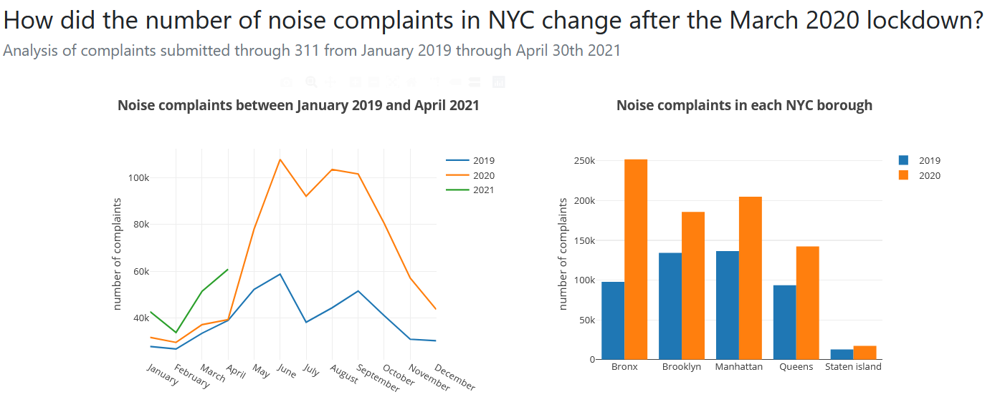

Full Stack Web Development - Noisy NYC Dashboard
---
**[Udacity Nanodegree in Data Science](https://www.udacity.com/course/data-scientist-nanodegree--nd025) - Project 2**

In this project I [__created and deployed a webapp dashboard__](https://noisy-nyc-app.herokuapp.com) with visualizations that describe **noise complaints in NYC from 2019 to 2021**. In the process, I used:
- **python3**: data analysis (pandas, numpy) and visualizations (plotly)
- **HTML, Bootstrap4, JavaScript**: front-end webpage
- **Flask**: back-end
- **Heroku**: deployment from github

 </img>

If you have any question, just send me a quick message via [LinkedIn](https://www.linkedin.com/in/josecruz-phd/). Enjoy!

## Table of Contents

- [Introduction](#introduction)
- [The data](#the-data)
- [Visualization](#visualization)
- [The code](#the-code)
- [Licensing and Acknowledgements](#licensing-and-acknowledgements)

## Introduction

In my [first project](https://github.com/joseferncruz/udacity-ds-project1), I used a public dataset to explore how the characteristics of **New York City** outdoor dinning offer during the pandemic. **In this project**, I looked at another angle of **New York City**: The noise and noise complaints submitted to the city.

It should not come as a surprise that NYC is very (very) noisy. As [NYC officials](https://www1.nyc.gov/site/doh/health/health-topics/noise.page) describe the problem: _'More than 30 million people in the U.S. have hearing loss due to exposure to loud noise. In **New York City**, nearly **one in six adults** report ringing in their ears or hearing loss.'_

A dataset that could help visualize the problem is the noise complaints dataset provide by NYC under the [Open Data Initiative](https://data.cityofnewyork.us/Social-Services/311-Service-Requests-from-2010-to-Present/erm2-nwe9/data). More precisely, I wondered how the complaints changed in the last year, when many New Yorkers where force to stay home during the pandemic.

The [__four visualizations__](https://noisy-nyc-app.herokuapp.com) that I created aim to answer the following __four questions__:

1. (top-left) What is the monthly variation of complaints in NYC from January 2019 to April 2021?

2. (top-right) Is the variation equal in the five NYC boroughs?  

3. (bottom-left) What are the top 3 sources of noise complaints in all NYC?

4. (bottom-right) How do the different types of noise complaints vary across the week in 2020?

## The data

The dataset is publicly available through the [New York City Open Data Initiative](https://data.cityofnewyork.us/Social-Services/311-Service-Requests-from-2010-to-Present/erm2-nwe9/data). The version available in the directory `data/
noise_data_clean.csv` was downloaded on May 5th, 2021.

## Visualization

You can access the deployed **[dashboard-app here](https://noisy-nyc-app.herokuapp.com/)** (internet access required).

## The code

In this repository, you can find code associated with all the different front-end and backend components of the dashboard. Particularly of interest may be:
-  `myapp/templates/index.html`: HTML, CSS and JavaScript front-end
- `myapp/routes.py`: flask backend
- `myapp/wrangling_scripts/gen_fig_data.py`: to generate ready data for plotting
- `myapp/wrangling_scripts/wrangle_data.py`: to create plotly objects to send to the front-end

## Licensing and Acknowledgements

The analysis and code generated during this project are licensed under a MIT License.

Acknowledgements are mostly to the effort of the NYC city hall to provide the datasets with accurate and updated information.  

---
_**Disclaimer**_
 The author is not affiliated with any of the entities mentioned nor received any kind of compensation. The information contained in this work is provided on an "as is" basis with no guarantees of completeness, accuracy, usefulness or timeliness.
